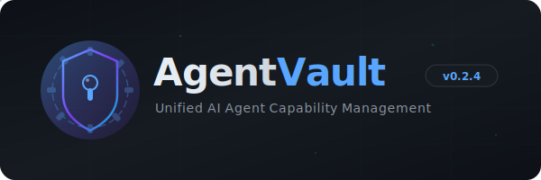

<p align="center">
  
</p>

<p align="center">
  <a href="https://github.com/aswin402/AgentVault/actions"></a>
  <a href="https://github.com/aswin402/AgentVault/releases"></a>
  <a href="LICENSE"></a>
  <a href="https://github.com/aswin402/AgentVault/stargazers"></a>
</p>

<p align="center">
  <b>Install once. Use everywhere.</b><br/>
  Unified local capability management for all your AI coding agents.
</p>

---

## What is AgentVault?

AgentVault is a centralized local capability registry that all your AI coding agents — Claude Code, Gemini CLI, OpenCode, Codex CLI, Cursor, and more — connect to. Instead of installing, configuring, and updating MCP servers, skills, and workflows separately for each agent, AgentVault manages them in **one place** and synchronizes configurations dynamically.

### The Problem

```
Agent A → installs filesystem-mcp → configures env → updates manually
Agent B → installs filesystem-mcp → configures env → updates manually  ← duplicated work
Agent C → installs filesystem-mcp → configures env → updates manually  ← 3x the effort
```

### The Solution

```
AgentVault → installs once → syncs to all agents → updates once → done
```

---

## ✨ Key Features

| Feature | Description |
|---------|-------------|
| 🛡️ **Unified Storage** | Centralized `~/.agentvault/` directory for all capability binaries, configs, and settings |
| 🌐 **MCP Gateway** | `vault serve --gateway` — aggregate all MCP servers behind a single endpoint |
| 🔌 **Smart Connectors** | Native adapters for Claude Code, Gemini CLI, OpenCode, and Codex CLI |
| 📦 **Multi-Source Install** | Install from npm, PyPI, GitHub, or local paths |
| 🧠 **Skills & Workflows** | Register prompt directories and multi-step execution graphs |
| 🔒 **Safety Defaults** | Automatic backups before any sync operation |
| 🖥️ **TUI Dashboard** | Interactive terminal UI with themes (slate, nord, dracula, monokai) |
| 🩺 **Health Checks** | `vault doctor --check-mcps` verifies MCP server responsiveness |
| 🐚 **Shell Completions** | Bash, Zsh, Fish, and PowerShell autocompletions + man pages |

---

## 🚀 Quick Start

### Install

```bash
# From source
git clone https://github.com/aswin402/AgentVault.git
cd AgentVault
cargo build --release
cp target/release/vault ~/.local/bin/
```

### Initialize

```bash
vault init
```

### Install an MCP Server

```bash
# From npm
vault install npm:@anthropic/mcp-filesystem --args '/home/user/projects'

# From PyPI
vault install pypi:mcp-server-memory

# From GitHub
vault install github:anthropics/mcp-server-brave-search
```

### Sync to Your Agent

```bash
vault sync claude      # Sync to Claude Code
vault sync gemini      # Sync to Gemini CLI
vault sync --all       # Sync to all connected agents
```

### Run as MCP Gateway

```bash
# Spawn all installed MCPs behind a single unified endpoint
vault serve --gateway
```

---

## 🌐 Gateway Architecture

When running `vault serve --gateway`, AgentVault acts as a unified MCP-to-MCP proxy:

```
┌──────────────┐    stdio     ┌───────────────────────┐
│   AI Agent   │◄────────────►│  vault serve          │
│ (Claude/etc) │              │  --gateway            │
└──────────────┘              └──────┬────────────────┘
                                     │ spawns & manages
                    ┌────────────────┼──────────────────┐
                    │                │                   │
              ┌─────▼──────┐  ┌──────▼───────┐  ┌───────▼───────┐
              │ brave-mcp   │  │ filesystem   │  │ memory-mcp    │
              │ (child)     │  │ (child)      │  │ (child)       │
              └────────────┘  └──────────────┘  └───────────────┘
```

**Key behaviors:**
- Tools are namespaced as `server__tool` to prevent collisions
- Per-child Mutex-serialized I/O prevents JSON corruption
- Install/remove/update automatically spawns/shuts down children
- `notifications/tools/list_changed` sent on any change

---

## 📖 Command Reference

| Command | Description |
|---------|-------------|
| `vault init` | Initialize vault workspace directory |
| `vault install <source>` | Install MCP server, skill, or workflow |
| `vault remove <name>` | Remove installed capability |
| `vault update [name]` | Update to latest version |
| `vault list` | List all installed capabilities |
| `vault search <query>` | Fuzzy search local + npm registry |
| `vault sync <agent>` | Sync configurations to agent connector |
| `vault serve` | Run as stdio MCP server |
| `vault serve --gateway` | Run as MCP gateway aggregator |
| `vault watch` | Watch agent configs and auto-sync on change |
| `vault status` | Show health, paths, and sync history |
| `vault config` | View/modify configuration |
| `vault doctor` | Run diagnostics and health checks |
| `vault connector` | Manage agent connectors |
| `vault export` / `vault import` | Export/import vault state |
| `vault ui` | Launch interactive TUI dashboard |
| `vault completions <shell>` | Generate shell autocompletions |

---

## 📂 Directory Layout

```text
~/.agentvault/
├── config.toml         # Central configuration
├── vault.db            # SQLite registry (WAL mode)
├── mcps/               # MCP server installations
├── skills/             # Registered skills and prompts
├── workflows/          # Workflow definitions
├── backups/            # Pre-sync configuration backups
└── logs/               # Operation and sync logs
```

---

## 🏗️ Architecture

AgentVault is built as a Rust workspace with three crates:

| Crate | Purpose |
|-------|---------|
| `vault-cli` | CLI binary, TUI dashboard, MCP server/gateway |
| `vault-core` | Registry, managers, gateway engine, config, search |
| `vault-connectors` | Agent connector implementations, sync engine |

---

## 🧪 Development

```bash
# Run tests
cargo test --workspace

# Check lints
cargo clippy --workspace --all-targets -- -D warnings

# Format
cargo fmt --all
```

---

## 📄 License

This project is licensed under the [MIT License](LICENSE).
